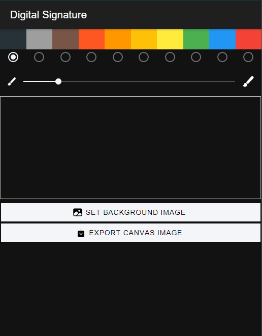
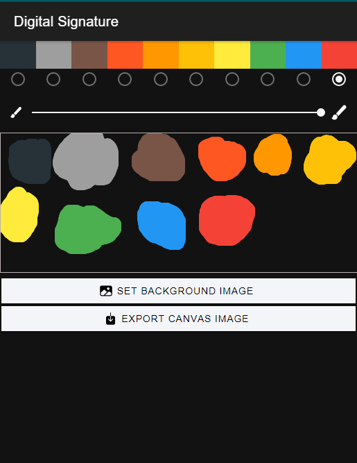
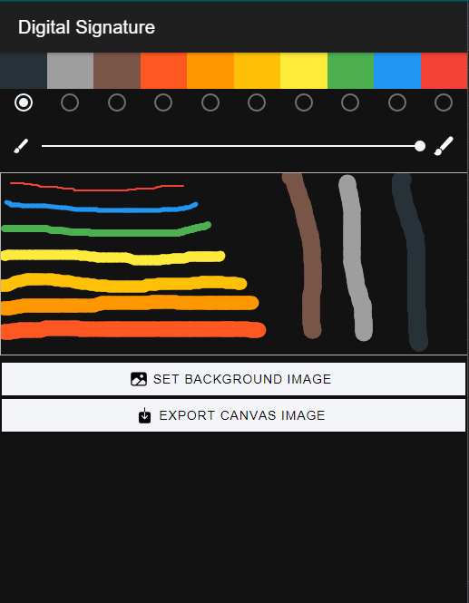
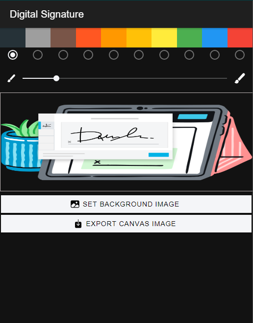

## Digital Signature ✍

##### Little app, to get digital signatures or just draw on it and convert it to an image and download or save to your gallery.

## Screenshots 
| home      | colors      | line Width       |
|------------|-------------|-------------|
|  |  |  |

| Background Image      |
|-------------|-------------|
|  |

## Instalations and cofigurations
1. `ionic start canvas-v0 blank --type=angular`
2. `npm i @ionic-native/base64-to-gallery` 
3. `ionic cordova plugin add cordova-base64-to-gallery`
